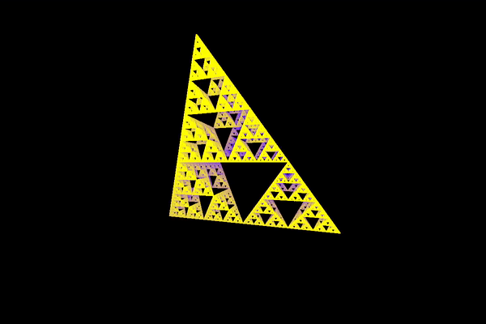

# 3D Fractals using Ray Marching

## Examples

Click on a spoiler to show a gif.

  
Infinite balls
 

  

  
Mirrored infinite balls
 

  

  
Sierpinski
 

  

  
Mandelbulb
 
  
  

  
Mandelbulb with constantly increasing power
 
  
  

